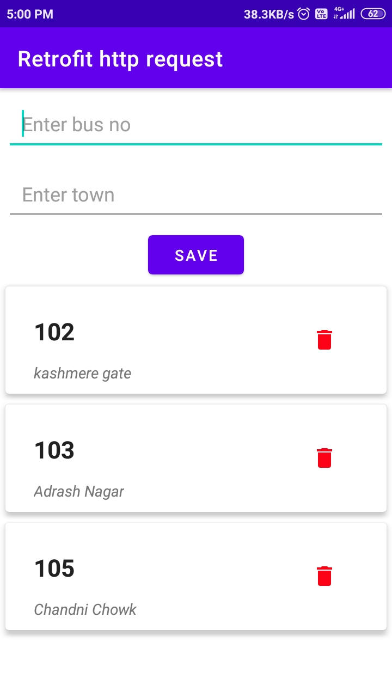
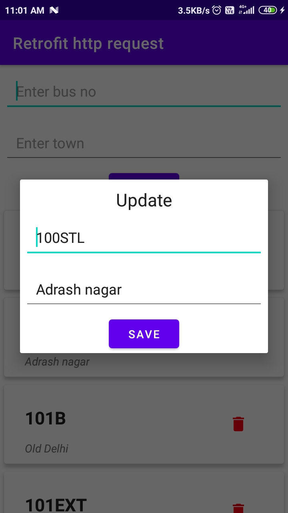

# Retofit-http-request-GET-POST-DELETE-PUT-in-android

Hey guys in this project we will learn how to do get,push,delete update data through real api ..

Api Link = https://dtc-api.herokuapp.com/bus/

<ul>
  <li>Get = /bus<li>
</ul>

Get = /bus
Post = /bus
update = /bus/{bus_Id}
delete = /bus/{bus_id}

